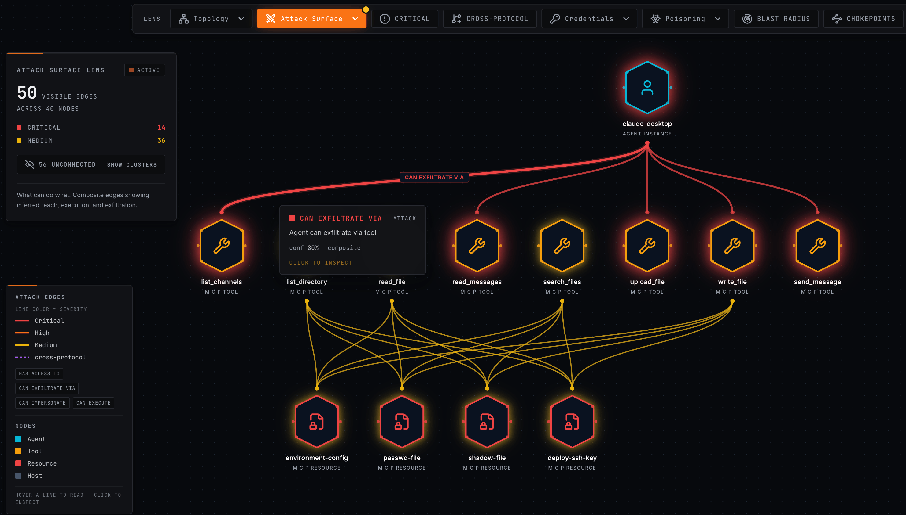
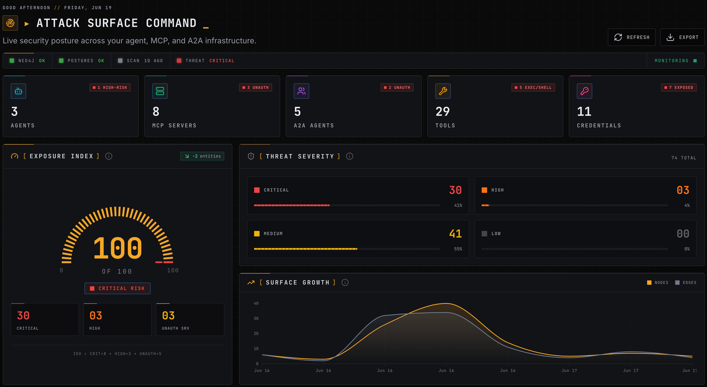
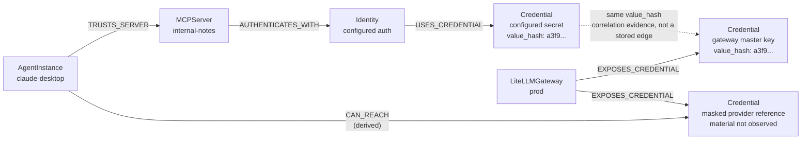

<div align="center">


### The offensive security framework for AI agent infrastructure

**MCP · A2A · model gateways · inference servers · vector stores · MLOps · notebooks · 12 agent clients**

[](https://redteamvillage.io/)

[Quickstart](#-quick-start) ·
[Capabilities](#-capabilities) ·
[Lifecycle](#-the-offensive-lifecycle) ·
[Graph Model](https://docs.agenthound.io/reference/graph-model/) ·
[Docs](https://docs.agenthound.io) ·
[Safety](#-safety--authorization)

[](https://github.com/adithyan-ak/agenthound/actions/workflows/ci.yml)
[](https://github.com/adithyan-ak/agenthound/releases)
[](https://goreportcard.com/report/github.com/adithyan-ak/agenthound)
[](LICENSE)
[](https://docs.agenthound.io/getting-started/install/)

</div>

> **Authorized use only.** AgentHound ships read-only discovery **and** active exploitation modules. Run it only against infrastructure you own or are written-authorized to assess. See [Safety & Authorization](#-safety--authorization).

**AgentHound is an open-source offensive security framework for AI agent infrastructure.** It runs the full engagement - recon, fingerprinting, credential looting, **modelfile / system-prompt / fine-tune inventory**, model inversion, tool and instruction poisoning, and config-implant persistence - across every layer of the modern agentic stack, then merges every fact into one Neo4j graph and proves the attack paths that tie it all together. Agenthound is BloodHound for the agentic stack.

## ⚡ Capabilities

<p align="center">
  
</p>

<table>
<tr>
<td width="50%" valign="top">

🌐 **Full-spectrum agentic attack surface**<br/>
One framework attacks every layer - MCP, A2A, model gateways, inference servers, vector stores, MLOps, notebooks, and 12 agent clients. The whole estate is one target set.

</td>
<td width="50%" valign="top">

🔓 **Credential inventory across the gateway & service plane**<br/>
Supply a LiteLLM master key to inventory masked upstream-provider references
and hashed virtual-key references with spend metadata. Only actual credential
values available to AgentHound participate in cross-service correlation.

</td>
</tr>
<tr>
<td width="50%" valign="top">

🧬 **Modelfile, system-prompt & fine-tune inventory**<br/>
Enumerate every model on an unauthenticated Ollama - names, digests, sizes,
stable modelfile hashes, system-prompt presence, and fine-tune signals. Raw
modelfiles, templates, and system prompts are available through an explicit
opt-in.

</td>
<td width="50%" valign="top">

🔬 **Model inversion / training-data residue extraction**<br/>
A pure-Go GGUF parser runs statistical inversion on the embedding matrix of any weight file you feed it to recover likely **fine-tune vocabulary tokens** - surfacing what a model was trained on as graph nodes.

</td>
</tr>
<tr>
<td width="50%" valign="top">

☠️ **Active exploitation - tool/instruction poisoning + config implant**<br/>
Rewrite a ContextForge-managed MCP tool description, inject `CLAUDE.md` / `.cursorrules`, or implant a malicious MCP server for persistence. Every mutation is dry-run by default and carries provider-specific recovery state.

</td>
<td width="50%" valign="top">

🗄️ **RAG, vector-store & notebook attack surface**<br/>
Inventory Qdrant collections and Jupyter sessions and notebook trees. Jupyter protected operations are tried without credentials first and retried with an operator-supplied bearer value only after a 401/403, so anonymous access is recorded only when it actually succeeds; bounded tree truncation is published as partial inventory.

</td>
</tr>
<tr>
<td width="50%" valign="top">

🕸️ **Cross-protocol & credential-chain attack paths**<br/>
15 post-processors compute the routes raw facts can't show - credential chains, cross-protocol pivots, and exfiltration paths across MCP and A2A.

</td>
<td width="50%" valign="top">

🧪 **Indirect prompt injection, modeled as data-flow**<br/>
Prompt injection treated as taint propagation: untrusted-input tools → tainted siblings → high-impact sinks, traced as real graph edges.

</td>
</tr>
<tr>
<td width="50%" valign="top">

📊 **Detection & standards intelligence**<br/>
19 prebuilt attack-path queries, 35 detection rules, 0–100 risk scoring, and retest-as-diff - crosswalked to OWASP MCP / Agentic Top 10 and MITRE ATLAS.

</td>
<td width="50%" valign="top">

🧩 **Write your own attacks**<br/>
A new attack against a new AI service is one module away - implement an action interface, drop a `register.go`, blank-import it. Same SDK, same lifecycle, same graph.

</td>
</tr>
</table>

## 🎯 Every plane of the stack is a target

| Surface | Discovery & inventory | Validation / active operations |
|---|---|---|
| **Agent clients** | 12 MCP client config formats plus instruction files (`CLAUDE.md`, `AGENTS.md`, `.cursorrules`) | Instruction poisoning and reversible malicious-server config implants |
| **MCP** | Stdio and HTTP/SSE servers, tools, resources, prompts, and authentication | Credential-reach verification; ContextForge tool-description poisoning and round-trip validation |
| **A2A** | Agent cards, JWS verification, skills, delegation, and authentication | Cross-protocol and delegation-path analysis |
| **LiteLLM** | Operator-supplied master-key record, masked provider references, and hashed virtual-key metadata with spend context | Cross-service credential correlation and path analysis |
| **Ollama / vLLM** | Ollama model metadata, stable modelfile hashes, system-prompt presence, and fine-tune signals; vLLM fingerprinting | Optional raw modelfile, template, and system-prompt capture; local GGUF extraction |
| **Qdrant** | Collections, point counts, and optional bounded payload samples | Read-only exposure analysis |
| **MLflow** | Experiments, runs, registered models, artifact/storage URIs, and verified anonymous-exposure evidence | Read-only exposure analysis |
| **Jupyter** | Sessions and bounded notebook trees | Read-only anonymous-versus-authenticated exposure analysis |
| **Open WebUI / LangServe** | Open WebUI authentication posture plus authenticated upstream/RAG credential inventory and observed exposure evidence; LangServe fingerprinting | Read-only credential inventory and exposure evidence |

## 📦 By the numbers

- **8 lifecycle CLI commands** - `scan` · `discover` · `loot` · `extract` · `poison` · `implant` · `revert` · `campaign` (`enumerate` + `fingerprint` run inside `scan`)
- **8 fingerprinters · 6 looters · 1 model-inversion extractor · 2 poisoners · 1 implanter**
- **Graph:** 23 node labels · 32 edge kinds (20 raw + 12 composite) · **15 post-processors**
- **Intelligence:** 35 text-detection rules + 7 YAML fingerprint rules + 1 code-backed Jupyter detector · 19 prebuilt attack-path queries · OWASP MCP Top 10 + OWASP Agentic Top 10 + MITRE ATLAS mappings
- **One static collector binary with no DB/UI/server dependencies.** Config-only discovery can run offline. Apache-2.0 releases include a Cosign-signed checksum manifest and per-archive SPDX SBOMs.

## 🚀 Quick start

Prerequisites: Docker + Compose v2. No Go, no Node, no `git clone`.

**1. Start the analysis server** - Neo4j + Postgres + UI, binds
`127.0.0.1:8080`:

```bash
curl -sSfL https://raw.githubusercontent.com/adithyan-ak/agenthound/main/docker/docker-compose.public.yml | docker compose -f - -p agenthound up -d --wait
```

**2. Install the collector** - single static binary → `~/.local/bin`:

```bash
curl -sSfL https://raw.githubusercontent.com/adithyan-ak/agenthound/main/install.sh | sh
export PATH="$HOME/.local/bin:$PATH"
```

**3. Scan local configs** - offline, read-only, raw credential values omitted -
and ingest them:

```bash
agenthound scan --config --ingest http://127.0.0.1:8080
```

The collector saves `./scan-<scan_id>.json` before upload, then prints a compact
ingest receipt. Use `--json` for the full receipt.

**4. Open the graph at
[http://127.0.0.1:8080](http://127.0.0.1:8080/).**

<p align="center">
  
</p>

Prefer Homebrew for both binaries?

```bash
brew tap adithyan-ak/agenthound
brew install adithyan-ak/agenthound/agenthound \
  adithyan-ak/agenthound/agenthound-server
```

<!-- Release automation updates this hidden compatibility pin:
https://raw.githubusercontent.com/adithyan-ak/agenthound/v1.0.1/install.sh
-->

Also available via `go install` and release archives with a Cosign-signed checksum
manifest and per-archive SPDX SBOMs - see the
[installation guide](https://docs.agenthound.io/getting-started/install/).

## 🔪 The offensive lifecycle

Collection commands write ingest-ready JSON. The quickstart above shows the
ingest pattern once.

**1. Recon** - find the AI estate:

Scan common AI-service ports and fingerprint what responds:

```bash
agenthound scan 10.0.0.0/24
```

Probe likely web ports for MCP and A2A protocol shapes:

```bash
agenthound discover 10.0.0.0/24
```

**2. Loot** - inventory credential evidence and model metadata:

With `LITELLM_MASTER_KEY` set, inventory LiteLLM credential references and
spend metadata:

```bash
agenthound loot 10.0.0.20:4000 --type litellm \
  --master-key "$LITELLM_MASTER_KEY"
```

Opt in to raw Ollama modelfiles, templates, and system prompts:

```bash
agenthound loot 10.0.0.10:11434 --type ollama \
  --include-credential-values
```

Looter types: `litellm`, `ollama`, `openwebui`, `mlflow`, `qdrant`, `jupyter`.

**3. Extract** - with `AI_MODEL_ID` set to an AIModel ID from the graph, invert
a locally-available GGUF weight file to recover fine-tune residue:

```bash
agenthound extract "$AI_MODEL_ID" --type embedding-invert \
  --artifact /path/to/model.gguf --commit --engagement-id ENG-1
```

**4. Validate, exploit, persist + revert** - run sanctioned, reversible
offensive actions:

With ContextForge authentication configured, run a reversible
poison-and-restore round trip against a managed MCP tool:

```bash
agenthound campaign \
  https://gateway.example/servers/0123456789abcdef0123456789abcdef/mcp \
  --scenario mcp-poison-roundtrip --adapter contextforge \
  --target-id support-lookup --engagement-id ENG-ROUNDTRIP --commit
```

Commit a targeted tool-description poison:

```bash
agenthound poison \
  https://gateway.example/servers/0123456789abcdef0123456789abcdef/mcp \
  --type mcp.tool.description --adapter contextforge \
  --target-id support-lookup --inject-file payload.txt \
  --commit --engagement-id ENG-1
```

Implant a malicious MCP server entry, then roll the engagement back:

```bash
agenthound implant localhost --type mcp.config.malicious-server \
  --file "$HOME/.cursor/mcp.json" --inject-file server-entry.json \
  --commit --engagement-id ENG-1

agenthound revert ENG-1
```

**5. Analyze** - pathfind and review:

```bash
curl -sSf http://127.0.0.1:8080/api/v1/analysis/prebuilt/credential-chain
curl -sSf 'http://127.0.0.1:8080/api/v1/analysis/findings?severity=critical'
```

See the full [CLI reference](https://docs.agenthound.io/reference/cli/) for
every verb, flag, and module.

## 🔎 What AgentHound finds

AgentHound's findings are built around the questions red teams and defenders ask when they need to understand reachability, blast radius, and pathing risk.

| Finding | What it means | Question it answers |
|---|---|---|
| **Credential-chain paths** | The same secret appears in multiple contexts, letting trust cross service boundaries. | Which reused credential gives an agent access it never explicitly had? |
| **Reachability** | Agents, MCP servers, tools, resources, prompts, A2A skills, and AI services are joined into one graph. | What can this agent actually reach if trust edges are followed? |
| **Execution paths** | An agent can reach shell-like, database, network, or other high-impact tools. | Which agents have a path to command execution, data-plane control, or production impact? |
| **Exfiltration paths** | An agent can read sensitive data and also reach an outbound channel. | Where can sensitive data leave the environment? |
| **Cross-protocol pivots** | MCP, A2A, host context, and AI-service infrastructure combine into one reachable path. | Can one agent protocol become a bridge into another trust domain? |
| **Tool poisoning** | Tool descriptions, prompts, or instruction files contain suspicious model-steering content. | Which tools or instructions could influence model behavior in unsafe ways? |
| **Tool shadowing** | A lookalike tool mimics a trusted capability or name. | Which tool could intercept or hijack an expected action? |
| **Rug pulls** | A tool's description, schema, or server instructions changed between scans. | What changed since the last known-good graph, and did it create a new risk path? |
| **Unauthenticated servers or agents** | MCP servers or A2A protocol handlers affirmatively accepted a credential-free probe; A2A uses a bounded read-only nonexistent-task lookup and never submits a message. | Which exposed agent surfaces need immediate review? |
| **Risk hotspots** | Nodes and paths are prioritized with risk scores and prebuilt graph queries. | Where should investigation or remediation start first? |

See [Detection Rules](https://docs.agenthound.io/reference/detection-rules/) and [Risk Scoring](https://docs.agenthound.io/reference/risk-scoring/) for the full catalog.

## 🔗 Path primitives

AgentHound doesn't just list findings - it creates graph edges you can chain, query, and report:

- **`CAN_REACH`**: an agent can traverse trust, credential, host, or protocol relationships to reach a target.
- **`CAN_EXECUTE`**: an agent can reach a tool capable of command, database, network, or code execution.
- **`CAN_EXFILTRATE_VIA`**: an agent can read sensitive data and send it through an outbound channel.
- **`CAN_IMPERSONATE`**: an A2A agent can act as another A2A agent.
- **`SHADOWS`**: a tool mimics a trusted tool closely enough to hijack expected behavior.
- **`POISONED_DESCRIPTION` / `POISONED_INSTRUCTIONS`**: tool or instruction text contains model-steering content.

These edges turn AI-agent infrastructure into something you can pathfind instead of manually reason about.

## 🗺️ Example path



No single config file declares this path. AgentHound hashes the supplied
LiteLLM master key, correlates it with the matching client-config credential by
`value_hash`, and computes the derived reachability edge once both outputs land
in the same graph. The dotted correlation is explanatory, not a stored
relationship. The provider target remains a reference-only finding: it does not
assert that AgentHound obtained usable upstream provider secret material.

## 🛡️ Safety & authorization

Built to be run under authorization, with the controls this audience checks for:

- **Read-only looter contract** - GET/HEAD by default, with documented lookup/search POSTs for APIs that expose no read equivalent and an opt-in Ollama embeddings compute POST via `--include-embeddings`; each looter is guarded by a `get_only_test.go` regression test.
- **Mutating verbs dry-run by default** - `poison`, `implant`, and mutation campaigns do not modify a target without `--commit`. `extract` performs its local analysis in dry-run and uses `--commit` only to emit ingest data.
- **Compile-time-mandatory recovery path** - `Poisoner` / `Implanter` embed `Reverter`; every destructive module must implement recovery. Runtime restoration is verified, not guaranteed across provider policy changes, conflicts, or unavailable targets.
- **Receipt before mutation** - the undo receipt is persisted to disk *before* the write lands.
- **AUTHORIZED gates + `--engagement-id`** - interactive first-run prompts for looting and offensive actions. IDs are required for `extract`, `poison`, `implant`, and `campaign`, optional for `loot`, and recorded on the evidence or receipts those commands emit.
- **Recon guardrails** - public-IP targets require `--allow-public-targets` plus interactive `AUTHORIZED`; `--authorization-file` optionally records a path + SHA-256 watermark. Link-local and multicast targets are refused, except for the explicit cloud-metadata address `169.254.169.254`.

**It is explicitly not** a C2, a stealth/evasion implant, or a multi-user SaaS. It is transparent, single-user authorized-assessment tooling, and the design says so.

Read the [security posture guide](https://docs.agenthound.io/operator/security/) and [offensive actions guide](https://docs.agenthound.io/operator/offensive-actions/).

## 📚 Docs · Contributing · License

[Quickstart](https://docs.agenthound.io/getting-started/quickstart/) · [CLI](https://docs.agenthound.io/reference/cli/) · [Graph Model](https://docs.agenthound.io/reference/graph-model/) · [Detection Rules](https://docs.agenthound.io/reference/detection-rules/) · [Security](https://docs.agenthound.io/operator/security/)

Write your own attack: implement an action interface, drop a `register.go`, blank-import it - see [CONTRIBUTING.md](CONTRIBUTING.md) and the [module authoring guide](https://docs.agenthound.io/contributing/modules/). Found a vulnerability in AgentHound itself? See [SECURITY.md](SECURITY.md).

AgentHound is licensed under the [Apache License 2.0](LICENSE).
