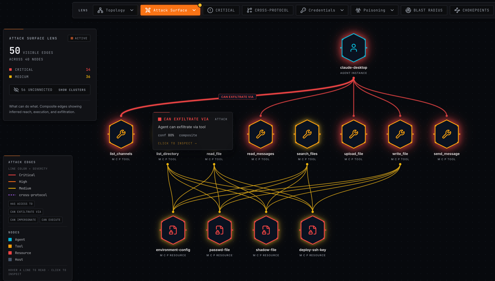
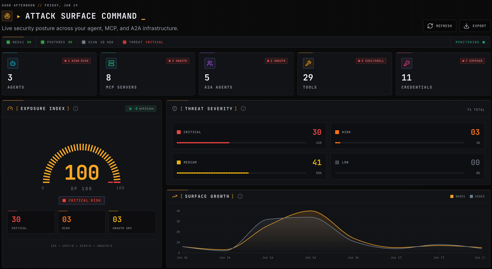

<div align="center">


### The offensive security framework for agentic infrastructure

**MCP · A2A · agent clients · model gateways · inference servers · vector stores · MLOps · notebooks**

<a href="https://redteamvillage.io/"></a> <a href="https://trendshift.io/repositories/96078?utm_source=repository-badge&amp;utm_medium=badge&amp;utm_campaign=badge-repository-96078" target="_blank" rel="noopener noreferrer"></a>

[Quickstart](#-quick-start) ·
[Capabilities](#-offensive-capabilities) ·
[Attack surface](#-every-plane-of-the-agentic-stack) ·
[Attack paths](#-what-agenthound-finds) ·
[Docs](https://docs.agenthound.io) ·
[Safety](#-safety--opsec)

[](https://github.com/adithyan-ak/agenthound/actions/workflows/ci.yml)
[](https://github.com/adithyan-ak/agenthound/releases/latest)
[](LICENSE)

</div>

> **Authorized use only.** AgentHound performs active credential validation, model invocation, and reversible mutation when their prerequisites are present. Run it only against systems you own or are authorized to assess.

**AgentHound is an open-source offensive security framework for agentic infrastructure.** Drop one static collector onto a compromised host and run one scan. AgentHound captures local credentials and agent configuration, discovers reachable AI services, fingerprints and inventories them, reuses compatible credentials, verifies concrete access, and preserves everything in one continuously checkpointed JSON artifact.

The default scan is active because foothold access may disappear at any moment. `--stealth` switches the same workflow to read-only collection when OPSEC requires it.

The optional analysis server turns the artifact into a queryable attack graph with credential chains, execution and exfiltration paths, cross-protocol pivots, evidence-backed findings, risk scoring, history, and triage.

```text
one foothold → one scan → secrets + services + proof → one artifact → full attack graph
```

## ⚡ Offensive capabilities

<p align="center">
  
</p>

<table>
<tr>
<td width="50%" valign="top">

🎯 **Foothold-first autonomous collection**<br/>
Local agent configs, instruction files, environment-backed secrets, loopback services, active interfaces, configured endpoints, and optional network scope all feed the same scan. No database or server connection is required on the compromised host.

</td>
<td width="50%" valign="top">

🔑 **Raw credential capture and reuse**<br/>
Concrete secrets are saved as usable material, deduplicated by value hash, and associated with every observed source. Newly discovered bearer tokens, API keys, master keys, and Jupyter tokens immediately unlock compatible same-scan collection and validation candidates.

</td>
</tr>
<tr>
<td width="50%" valign="top">

🧪 **Proof instead of reachability guesses**<br/>
For an eligible MCP resource, AgentHound first performs an anonymous control read. If that exact read succeeds, it records public access without presenting a credential. Otherwise, it follows with an authenticated read; a denied control plus an allowed credentialed read becomes **Verified During Scan** evidence tied to that credential and resource.

</td>
<td width="50%" valign="top">

☠️ **Reversible active validation**<br/>
Against eligible ContextForge-managed tools, the planner writes a scan-specific description marker, observes it through MCP, restores the original immediately, and independently confirms restoration before any other work continues.

</td>
</tr>
<tr>
<td width="50%" valign="top">

🌐 **Full-spectrum agentic attack surface**<br/>
AgentHound maps MCP, A2A, twelve agent-client configuration formats, model gateways, inference servers, vector stores, model registries, notebooks, and web interfaces as one connected target set.

</td>
<td width="50%" valign="top">

🧬 **Deep service and model intelligence**<br/>
Inventory Ollama served models, modelfiles, templates, and system prompts; LiteLLM credential references and virtual-key context; MLflow experiments and model registries; Jupyter sessions and files; and Qdrant collections. Deep mode adds recursive instruction discovery, bounded vector sampling summaries, and Ollama compute verification.

</td>
</tr>
<tr>
<td width="50%" valign="top">

🕸️ **Graph-native attack-path analysis**<br/>
The server joins trust, authentication, credential reuse, tool capabilities, sensitive resources, protocol boundaries, and observed proof into paths a red-team operator can query: reachability, execution, exfiltration, impersonation, shadowing, poisoning, and tainted data flow.

</td>
<td width="50%" valign="top">

💾 **Built for loss of access**<br/>
The collector writes an ingest-valid artifact before collection and checkpoints every meaningful result and action transition. Recovery state is persisted before mutation, cleanup runs even after cancellation, and unresolved restoration can be retried from the same artifact.

</td>
</tr>
</table>

## 🎯 Every plane of the agentic stack

| Surface | Discovery and collection | Autonomous validation and analysis |
|---|---|---|
| **Agent clients** | Claude Desktop, Claude Code, Cursor, Windsurf, VS Code, Cline, Continue, Zed, JetBrains, Kiro, Amazon Q, and Augment configs; `CLAUDE.md`, `AGENTS.md`, Cursor rules, and Copilot instructions | Captures concrete config credentials; detects exposed secrets, suspicious instructions, poisoned context, and unpinned server packages |
| **MCP** | Configured stdio and network servers; tools, resources, prompts, transport, authentication, and server instructions | Differential credential-to-resource proof; public-access evidence; reversible ContextForge description round trip |
| **A2A** | Agent cards, skills, delegation, authentication schemes, signatures, and remote JWKS evidence | Authenticated agent-card enrichment, impersonation and confused-deputy analysis, and cross-protocol pathing |
| **LiteLLM** | Gateway posture, observed master keys, upstream-provider references, virtual-key hashes, models, aliases, and spend context | Compatible credential reuse, credential-chain correlation, and exposed-master-key findings |
| **Ollama / vLLM** | Ollama model inventory, digests, modelfiles, templates, system prompts, and fine-tune signals; vLLM fingerprinting | Deep active mode invokes a bounded embedding request to prove model-compute access |
| **Qdrant** | Typed vector collections, point counts, schema context, and bounded sampling summaries in deep mode | Anonymous exposure and sensitive vector-data analysis without per-point graph expansion |
| **MLflow** | Experiments, runs, registered models, model versions, and artifact/storage URIs | Anonymous tracking and registry exposure analysis |
| **Jupyter** | Sessions and bounded notebook/content trees, first anonymously and then with a compatible token | Distinguishes public from credential-gated notebook access |
| **Open WebUI / LangServe** | Open WebUI authentication posture and authenticated upstream/RAG credential inventory; LangServe fingerprinting | Credential expansion and exposed-service analysis |

## 🚀 Quick start

### 1. Install the collector

Install the 1.1.1 static binary to `~/.local/bin`:

```bash
curl -sSfL https://raw.githubusercontent.com/adithyan-ak/agenthound/1.1.1/install.sh \
  | AGENTHOUND_VERSION=1.1.1 sh
export PATH="$HOME/.local/bin:$PATH"
```

Or install with Homebrew:

```bash
brew install adithyan-ak/agenthound/agenthound
```

The collector has no Neo4j, PostgreSQL, Node.js, or server dependency.
The shell installer supports macOS and Linux on amd64 or arm64. Windows builds
are available from [GitHub Releases](https://github.com/adithyan-ak/AgentHound/releases).

### 2. Run one scan

Start with the compromised host and everything it can immediately reveal:

```bash
agenthound scan --output scan.json
```

Add a host, CIDR, or targets file without disabling local collection:

```bash
agenthound scan 10.20.0.0/24 --output scan.json
agenthound scan @targets.txt --deep --exclude 10.20.0.15 --output scan.json
```

Choose the mode that matches the operation:

| Command | Behavior |
|---|---|
| `agenthound scan` | Active collection, compatible credential reuse, MCP access proof, and eligible reversible ContextForge validation |
| `agenthound scan --deep` | Adds recursive instruction discovery, Qdrant sampling summaries, expensive service probes, and bounded Ollama embedding invocation |
| `agenthound scan --stealth` | Anonymous and exact configured read-only collection; no cross-target credential reuse, model invocation, tool invocation, or mutation |
| `agenthound scan --stealth --deep` | Adds deep filesystem and payload reads while retaining stealth restrictions |

These commands are alternatives and write `scan.json`. Without `--output`, the result is `scan-<scan_id>.json`. An explicit output path replaces an existing file, so use a new name for each scan. Concrete credentials and collected content are stored directly in the artifact; treat it as operationally sensitive.

If the final summary reports unresolved cleanup, preserve the artifact and retry safely:

```bash
agenthound revert scan.json
```

### 3. Analyze the attack graph

The server is optional during collection. Start it on the analysis system when you are ready to ingest:

```bash
curl -sSfL \
  https://raw.githubusercontent.com/adithyan-ak/agenthound/1.1.1/docker/docker-compose.public.yml \
  -o agenthound-compose.yml
docker compose -f agenthound-compose.yml -p agenthound up -d --wait
docker compose -f agenthound-compose.yml -p agenthound exec -T agenthound \
  agenthound-server ingest - < scan.json
```

Open [http://127.0.0.1:8080](http://127.0.0.1:8080/) to inspect findings, attack paths, credentials, risk, queries, scan history, and triage.

Use the collector and server from the same release. Releases after `1.1.1` pin
the exact server image in Compose; older Compose files retain their historical
`latest` reference. A current server accepts supported older V1 artifacts. If
ingest reports an unsupported contract, upgrade the server instead of editing
the artifact.

<p align="center">
  
</p>

## 🔪 One autonomous offensive workflow

`agenthound scan` drives the operational loop without requiring the operator to choose a module for every discovered service:

1. **Map the foothold** — parse supported agent configs and instruction sources; capture concrete credentials and configured endpoints.
2. **Discover the reachable estate** — seed local interfaces and explicit targets, scan standard AI-service ports, and fingerprint responding services.
3. **Collect useful data** — enumerate MCP and A2A, then inventory applicable gateways, inference servers, vector stores, MLOps services, notebooks, and web interfaces.
4. **Expand with credentials** — present newly observed material only to compatible service adapters and generate new candidates as access grows.
5. **Prove access** — perform differential MCP resource reads, eligible reversible ContextForge round trips, and deep Ollama compute verification.
6. **Preserve evidence** — merge every observation, action outcome, proof, and recovery transition into the continuously checkpointed artifact.
7. **Pathfind** — ingest later to build full-graph reachability, execution, exfiltration, credential-chain, and cross-protocol findings.

Independent collection failures do not block unrelated work. A checkpoint failure or unresolved mutation cleanup stops new forward work so the artifact remains the source of truth.

## 🔎 What AgentHound finds

| Finding | What it answers |
|---|---|
| **Verified credential access** | Which exact credential proved access to which exact MCP resource during this scan? |
| **Credential-chain paths** | Where does the same concrete secret connect agent configuration, gateways, identities, and services? |
| **Reachability** | What can an agent reach by following current trust, authentication, capability, and host evidence? |
| **Execution paths** | Which agents can reach tools capable of shell, code, database, or network execution? |
| **Exfiltration paths** | Where can sensitive resource access combine with an outbound-capable tool? |
| **Cross-protocol pivots** | Where can MCP, A2A, host context, and AI-service infrastructure bridge trust boundaries? |
| **Instruction poisoning with proof** | Which instruction files contain review signals or strong compound poisoning evidence, and what exact lines triggered the verdict? |
| **Tool shadowing and rug pulls** | Which lookalike tools or changed descriptions can hijack an expected capability? |
| **Unauthenticated surfaces** | Which MCP, A2A, notebook, registry, vector, or model services exposed useful data without a credential? |
| **Risk hotspots** | Which nodes and paths deserve immediate operator attention based on impact, exposure, and graph position? |

Core graph primitives include `CAN_REACH`, `CAN_EXECUTE`, `CAN_EXFILTRATE_VIA`, `CAN_IMPERSONATE`, `SHADOWS`, `POISONED_DESCRIPTION`, `INSTRUCTION_SIGNAL`, `POISONED_INSTRUCTIONS`, `TAINTS`, and `IFC_VIOLATION`. Instruction findings retain bounded matched excerpts with paths and line numbers; the hash remains secondary integrity metadata. See the [Attack Paths guide](docs/operator/attack-paths.md) and [Graph Model](docs/reference/graph-model.md) for their evidence semantics.

## 🛡️ Safety & OPSEC

AgentHound is designed for authorized operation from a compromised host:

- **Active by default:** compatible credential reuse, differential access reads, deep model invocation, and eligible reversible mutation happen in the initial scan.
- **Read-only switch:** `--stealth` disables cross-target credential presentation, compute and tool invocation, and mutation while preserving anonymous and exact configured collection.
- **Hard exclusions:** repeatable `--exclude` rules are enforced against hostnames, IPs, CIDRs, DNS results, redirects, derived URLs, cleanup requests, and final socket dials.
- **Immediate recovery:** reversible actions persist original state before mutation, restore immediately under a separate cleanup context, and confirm the original before planning continues.
- **Plaintext evidence:** concrete secrets, returned content, action outcomes, and recovery data remain available in the JSON artifact. The dashboard masks credential values by default and keeps Reveal and Copy one click away.

Read [Security and OPSEC](docs/operator/security.md) before using active mode in a constrained environment.

## 📚 Documentation and development

[Install](docs/getting-started/install.md) ·
[Quickstart](docs/getting-started/quickstart.md) ·
[Scanner](docs/operator/scanner.md) ·
[CLI](docs/reference/cli.md) ·
[Attack Paths](docs/operator/attack-paths.md) ·
[Deployment](docs/operator/deployment.md) ·
[Security](docs/operator/security.md)

The collector remains a static binary with no database or server dependency. New service intelligence and autonomous actions are registered as modules and participate in the same artifact, planner, contact-policy, and evidence contracts. See [CONTRIBUTING.md](CONTRIBUTING.md) and [Writing Modules](docs/contributing/modules.md).

AgentHound is licensed under the [Apache License 2.0](LICENSE). To report a vulnerability in AgentHound itself, see [SECURITY.md](SECURITY.md).
