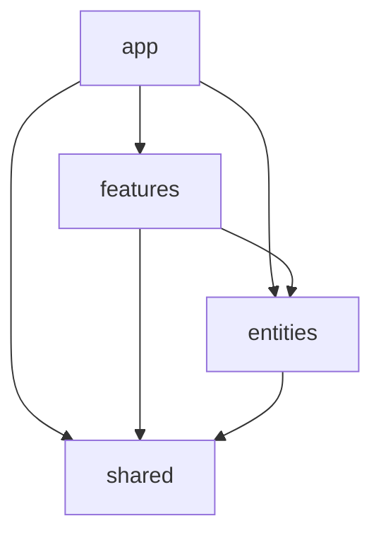

# UI architecture

The dashboard uses four feature-sliced layers. Imports may point only to the same layer where allowed or to a lower layer.

| Layer | Alias | Responsibility |
|---|---|---|
| `app` | `@app` | Entry point, routes, providers, shell, navigation, and root error handling. |
| `features` | `@features` | Product areas such as dashboard, explorer, findings, inspector, queries, rules, and scans. |
| `entities` | `@entities` | Domain models, repositories, and typed data access. |
| `shared` | `@shared` | API client, tokens, UI primitives, layouts, feedback, and generic utilities. |


```mermaid
flowchart TD
  app["app"] --> features
  app --> entities
  app --> shared
  features["features"] --> entities
  features --> shared
  entities["entities"] --> shared
```

`features` may import only its own feature plus `entities` and `shared`. `entities` may import sibling entities and `shared`. `shared` contains no product-domain imports. ESLint enforces these boundaries.

## Placement

| Addition | Location |
|---|---|
| Route, provider, or application shell | `src/app/` |
| Page or widget for one product area | `src/features/<area>/ui/` |
| Feature-local hook, store, or helper | `src/features/<area>/model/` |
| Domain accessor or view model | `src/entities/<name>/` |
| Reusable UI primitive | `src/shared/ui/primitives/` |
| Stack, grid, or cluster layout | `src/shared/ui/layout/` |
| Cross-feature widget or chart | `src/shared/ui/widgets/` |
| Loading, empty, and error states | `src/shared/ui/feedback/` |
| API or QueryClient configuration | `src/shared/api/` |
| Color or design token | `src/shared/theme/tokens.ts` |
| Generic utility | `src/shared/lib/` |

## Validation

```bash
npm run lint
npm test
npm run build
```

ESLint enforces import boundaries, while the theme parity tests keep duplicated token sources synchronized.
